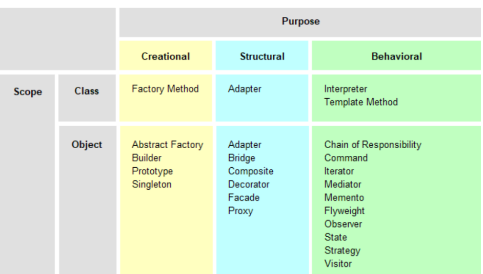
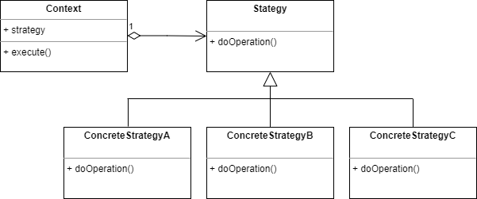
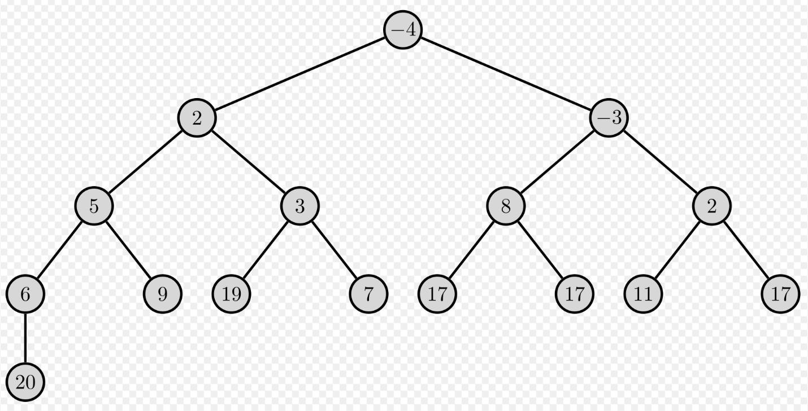

# Projekt: Design Patterns
## Literatur
* Design Patterns, Elements of Reusable Object-Oriented Software, Erich Gamma, Richard Helm, Ralph Johnson, John Vlissides, ADDISON-WESLEY PROFESSIONAL COMPUTING SERIES
## Was sind Design Patterns ?
„Jedes Pattern beschreibt ein Problem, welches immer wieder vorkommt und dann
beschreibt es den Kern der Lösung des Problems, so dass Du diese Lösung eine
Million Mal verwenden kannst, ohne dass Du zweimal dasselbe machst.“
(Christopher Alexander über Patterns bei Gebäuden und Städten)


## Klassifikation von Design Patterns


## Design Pattern: Strategy
Das Strategy Design Pattern ist ein Entwurfsmuster, das es ermöglicht, Algorithmen in austauschbare Module zu unterteilen, die dynamisch ausgetauscht werden können, je nachdem welche Strategie zu einem bestimmten Zeitpunkt benötigt wird. Folgendes Klassendiagramm beschreibt das Pattern:



Ziel der folgenden Aufgaben ist es, das Strategy Design Pattern zu verwenden, um verschiedene Sortier-Algorithmen zu implementieren. Die Implementierung soll es ermöglichen, dass der Algorithmus zur Sortierung zur Laufzeit ausgetauscht werden kann, ohne dass der Rest des Codes davon betroffen ist. 


Die folgenden Schritte sind zu implementieren:

* **Aufgabe 1:** Implementieren Sie das Interface *SortStrategy*, das die Methoden *sort* und *measureRuntime* definiert. Die Methode *measureRuntime* retourniert die Dauer einer konkreten Sortierung  in Nano-Sekunden. Sie sind frei in der Wahl der Input-Parameter. Versuchen sie diese möglichst flexibel zu halten.

* **Aufgabe 2:** Implementieren Sie die Abstrakte Klasse *AbstractSortStrategy*, welche das Interface *SortStrategy* realisiert, jedoch nur die Methode *measureRuntime* implementiert.

* **Aufgabe 3:** Erstellen Sie eine konkrete Klasse, welche die Sortierstrategie BubbleSort implementiert. 
Siehe dazu das Kapitel *BubbleSort* im Anhang.

* **Aufgabe 4:** Erstellen Sie eine konkrete Klasse, welche die Sortierstrategie MergeSort implementiert. 
Siehe dazu das Kapitel *MergeSort* im Anhang.

* **Aufgabe 5:** Erstellen Sie eine konkrete Klasse, welche die Sortierstrategie HeapSort implementiert. Die Klasse HeapSort verwendet intern die Klasse MinHeap, welche Sie auch implementieren sollen.
Siehe dazu das Kapitel *HeapSort* im Anhang.

* **Aufgabe 6:** Erstellen Sie eine Klasse *SortContext*, die eine Instanz des Interfaces *SortStrategy* enthält. Diese Klasse soll eine Methoden *sort* und *measureRuntime* enthalten, welceh das Sortieren der Daten mit der aktuellen Sortierstrategie durchführen.

* **Aufgabe 7:** Programmieren Sie eine Klasse *SortClient* , die die Daten bereitstellt und die Sortierung durchführt. Es sollen mehrere Sortierstratgien ausgewählt und aufgerufen werden. 

* **Aufgabe 8:** Testen Sie die Implementierung, indem Sie verschiedene Sortierstrategien auswählen und die Ergebnisse überprüfen. Verwenden Sie JUnit 5.

* **Aufgabe 9:** Dokumentieren Sie Ihre Implementierung ausführlich mit Javadoc. 

* **Aufgabe 10:** Erstellen Sie ein Klassendiagramm mit draw.io, um die Beziehungen zwischen den Klassen zu zeigen.

* **Aufgabe 11:** Optional können Sie die Implementierung um weitere Sortieralgorithmen erweitern und die Leistung der verschiedenen Algorithmen miteinander vergleichen.

Viel Spass bei der Implementierung!

# Anhang
## BubbleSort
Das BubbleSort-Verfahren ist ein einfacher Sortieralgorithmus, der Elemente einer Liste durch Vergleich und Vertauschung miteinander sortiert. Der Algorithmus arbeitet, indem er benachbarte Elemente in der Liste vergleicht und sie vertauscht, wenn sie in der falschen Reihenfolge sind. Dieser Vorgang wird solange wiederholt, bis die Liste vollständig sortiert ist.

Bubble-Sort besteht aus folgenden Schritten:

1. Durchlaufe die Liste von links nach rechts.
Vergleiche jedes benachbarte Element miteinander. Wenn das linke Element größer als das rechte Element ist, tausche sie.

2. Wiederhole diesen Vorgang bis zum Ende der Liste.
Beginne erneut am Anfang der Liste, ignoriere aber die bereits sortierten Elemente am rechten Ende der Liste.

## MergeSort
MergeSort ist ein rekursiver Sortieralgorithmus, der eine Liste in immer kleinere Teile aufteilt, bis diese nur noch aus einzelnen Elementen besteht. Anschließend werden diese sortierten Teillisten wieder zusammengeführt (gemerged). Der folgende Pseudo-Code illustriert die Funktionsweise von MergeSort:

```scss
function merge_sort(list)
    if length(list) <= 1
        return list
    
    mid = length(list) / 2
    left_list = list[:mid]
    right_list = list[mid:]

    left_list = merge_sort(left_list)
    right_list = merge_sort(right_list)

    return merge(left_list, right_list)
```

Die merge-Funktion nimmt zwei sortierte Listen als Argumente und gibt eine einzige sortierte Liste zurück. Die Elemente der beiden Listen werden nacheinander verglichen und in eine Ergebnisliste eingefügt, wobei das kleinere Element zuerst eingefügt wird. Nachdem alle Elemente einer der Listen durchlaufen wurden, werden die verbleibenden Elemente der anderen Liste einfach an das Ende der Ergebnisliste angefügt.

## HeapSort
### Heap
Der HeapSort-Sortieralgorithmus verwendet intern den Abstrakten Datentyp (ADT) MinHeap. Ein MinHeap hat folgende Eingenschaften:

1. Die Elternknoten sind immer kleiner als ihre Kindknoten. Dies ist das Min-Heap-Prinzip.

1. Der Heap hat eine Baumstruktur, wobei jeder Knoten höchstens zwei Kinder hat, die von links nach rechts eingefügt werden.

1. Der Heap ist vollständig gefüllt bis auf die unterste Ebene, die von links nach rechts aufgefüllt wird. Dies bedeutet, dass der Heap immer eine perfekte Binärbaum-Struktur hat.

1. Der Wert des Wurzelknotens ist immer das Minimum des Heaps.

1. Jeder Knoten des Heaps hat eine eindeutige Position. Wenn die Knoten als Array organisiert werden, können die Indizes der Knoten berechnet werden.

Um den Index des Parent und der beiden Children eines Knotens in einem Heap zu berechnen, gibt es eine einfache mathematische Formel:

* Der Index des Parent eines Knotens mit Index i ist (i-1)/2.

* Der Index des linken Kindes eines Knotens mit Index i ist (2*i)+1.

* Der Index des rechten Kindes eines Knotens mit Index i ist (2*i)+2.

Beachten Sie, dass diese Formeln nur für 0-basierte Arrays funktionieren. Folgende Abbildung zeigt ein Beispiel für einen MinHeap.



Die Methoden der Klasse *MinHeap* lassen sich wie folgt zusammenfassen:

* **insert:** Fügt ein neues Element zum Heap hinzu und stellt sicher, dass die Heap-Eigenschaften beibehalten werden, indem das Element so lange nach oben verschoben wird, bis sein Elternelement kleiner ist oder bis es die Wurzel erreicht.

* **peek:** Gibt das kleinste Element im Heap zurück, ohne es aus dem Heap zu entfernen.

* **extractMin:** Entfernt und gibt das kleinste Element im Heap zurück und stellt sicher, dass der Heap nach dem Entfernen des Elements immer noch gültig ist, indem das letzte Element an die Spitze verschoben und dann nach unten geschoben wird, bis es an die richtige Position im Heap gelangt.

* **size:** Gibt die Anzahl der Elemente im Heap zurück.

* **isEmpty:** Gibt true zurück, wenn der Heap leer ist, andernfalls false.

* **clear:** Entfernt alle Elemente aus dem Heap.

* **buildHeap:** Erstellt einen Min-Heap aus einem Array von Elementen, indem jedes Element zum Heap hinzugefügt wird. Die Heap-Eigenschaften werden sichergestellt.

Zusätzlich werden folgende privaten Hilfsmethoden verwendet:
* **heapifyUp**: Stellt die Heap-Eigenschaften von unten nach oben wieder her, indem das i-te Element im Heap so lange nach oben verschoben wird, bis sein Elternelement kleiner ist oder bis es die Wurzel erreicht.

* **heapifyDown():** Stellt die Heap-Eigenschaften von oben nach unten wieder her, indem das i-te Element so lange nach unten verschoben wird, bis es an der richtigen Position im Heap angekommen ist.

